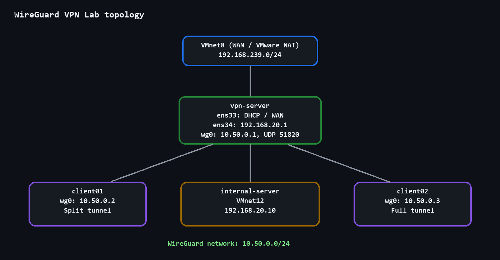
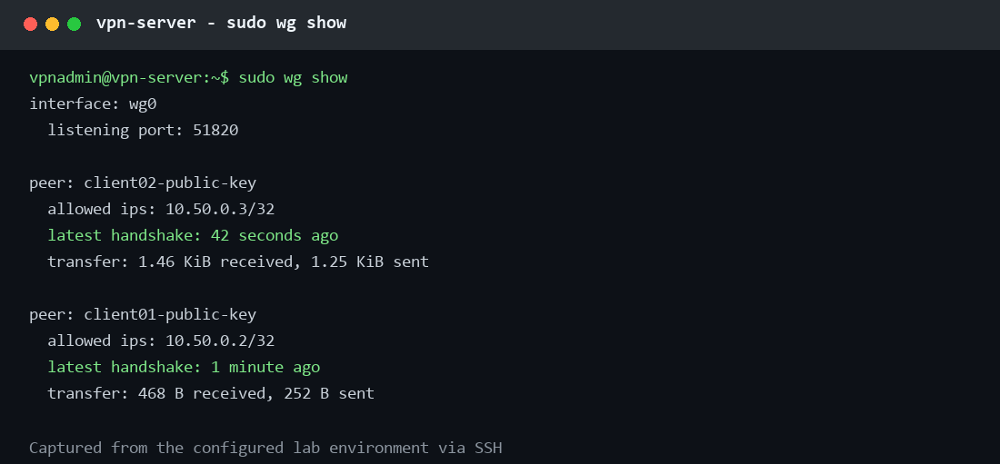
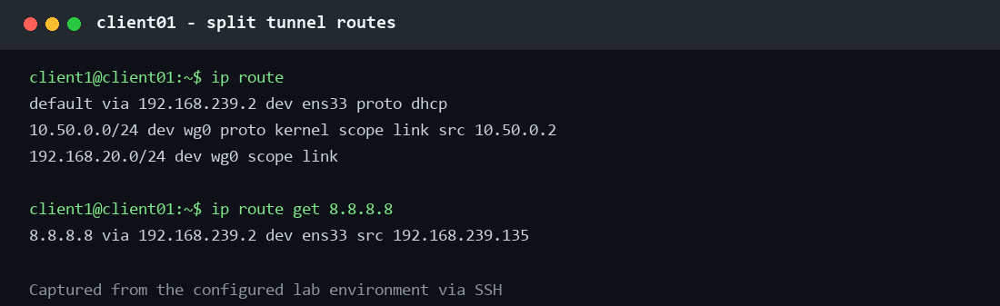
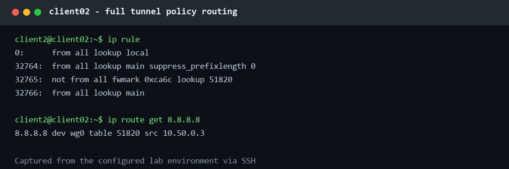
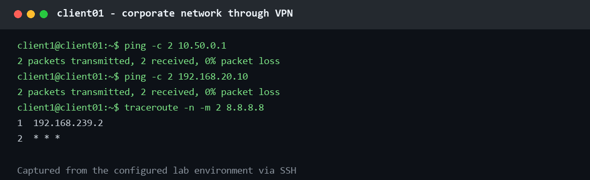
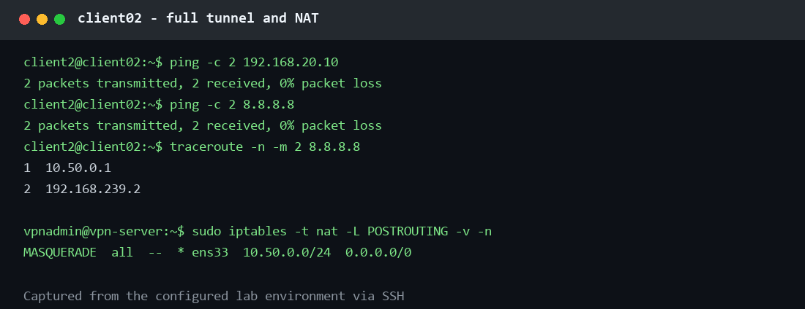

# WireGuard VPN Lab

Лабораторная работа по WireGuard: безопасный удалённый доступ к внутренней сети,
split tunnel для `client01` и full tunnel для `client02`.

## Схема

```text
VMnet8 (WAN / NAT)
    |
vpn-server: WAN DHCP + Internal 192.168.20.1
    | wg0: 10.50.0.1/24, UDP 51820
    +-- client01: 10.50.0.2 (split tunnel)
    +-- client02: 10.50.0.3 (full tunnel)
    |
VMnet12 (Internal)
    +-- internal-server: 192.168.20.10
```

## Адреса

| Узел | Адрес |
| --- | --- |
| `vpn-server` internal | `192.168.20.1/24` |
| `internal-server` | `192.168.20.10/24` |
| WireGuard server | `10.50.0.1/24` |
| `client01` | `10.50.0.2/24` |
| `client02` | `10.50.0.3/24` |

## Что проверено

- [x] `wg0` поднят на сервере, UDP 51820 слушается.
- [x] Созданы отдельные ключи server/client01/client02.
- [x] Handshake обоих клиентов подтвержден через `wg show`.
- [x] Оба клиента видят `10.50.0.1` и `192.168.20.10`.
- [x] `client01` использует split tunnel.
- [x] `client02` использует full tunnel и NAT на VPN-сервере.
- [x] IP forwarding, firewall и masquerade работают.
- [x] Выполнены искусственные troubleshooting-сценарии.
- [x] Добавлены скриншоты в `screenshots/`.

## Документация

- [Architecture](docs/architecture.md)
- [Addressing](docs/addressing.md)
- [WireGuard](docs/wireguard.md)
- [Split tunnel](docs/split-tunnel.md)
- [Full tunnel](docs/full-tunnel.md)
- [Firewall](docs/firewall.md)
- [Troubleshooting](docs/troubleshooting.md)
- [Actual test results](docs/evidence.md)

Приватные ключи в Git не добавляются.

## Screenshots

Терминальные карточки ниже сформированы из фактических результатов проверок по
SSH. Приватные ключи в них скрыты.












